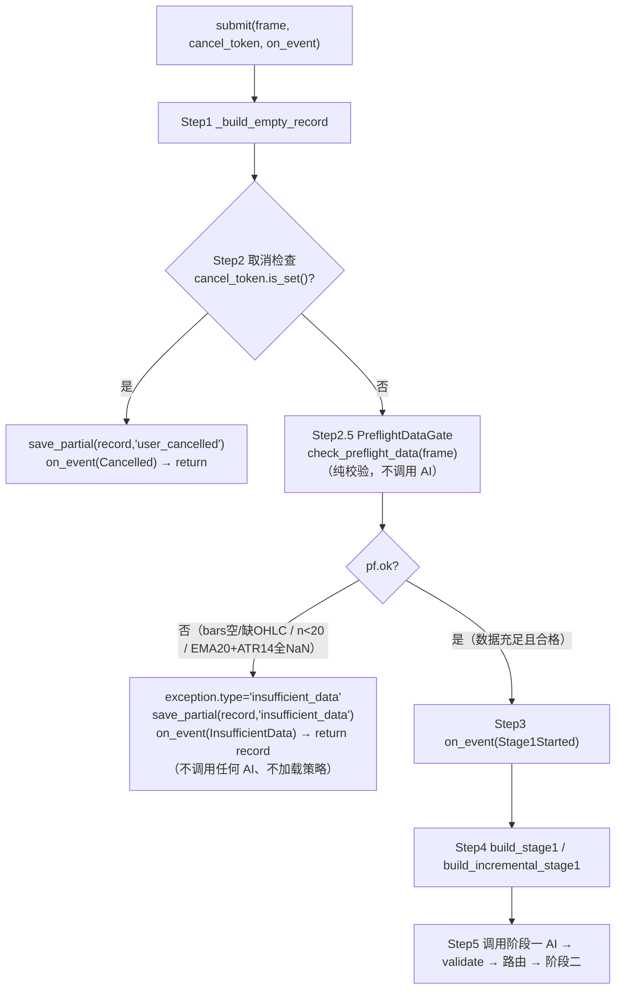
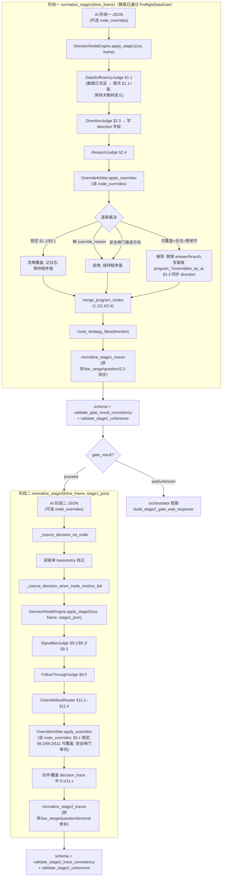
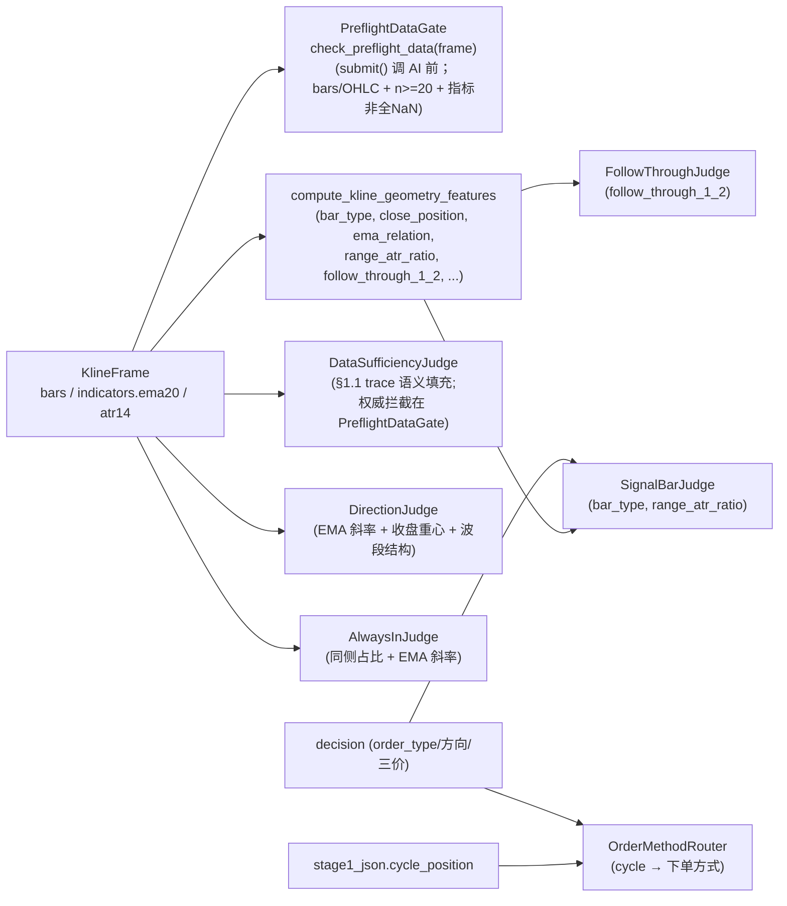

# 设计文档：确定性决策节点（deterministic-decision-nodes）

## Overview（总体设计）

本设计把二元决策树中**判据为纯确定性数值/结构规则**的节点，从「由 AI 撰写 answer/branch/reason」改为「由程序确定性判定」，并彻底移除市场可读性闸门节点 §0.1/§0.2。在此之上，叠加一层**受控覆盖机制**：程序判定为权威默认，AI 仅在具备程序规则未捕捉到的明确结构性理由时，对部分节点提交受约束的覆盖。

改造目标：

1. 降低 AI token 用量：AI 不再为这些节点输出内容（默认直接采纳程序判定）。
2. 消除 AI 在确定性节点上的判断错误：这些节点的判据本就是 `compute_kline_geometry_features`、EMA20、ATR14 已能精确计算的事实。
3. 在保留 token 节省的同时，不被程序的规则盲点拖累，且不削弱任何安全约束：通过受控覆盖让 AI 能推翻程序判错的判断类节点，但锁定节点不可覆盖、安全闸门只能更保守。
4. 把硬性前置条件（数据充足度/数据质量，§1.1）的判定时机前移到**调用阶段一 AI 之前**：数据不足时根本不把数据上传给 AI，直接显式报错（`insufficient_data`），实现数据不足时**零 AI token 消耗**。

核心做法分两层：

**第一层——前置数据闸门 `PreflightDataGate`（§1.1 权威判定）**：在 `pa_agent/orchestrator/two_stage.py` 的 `submit()` 中、**调用阶段一 AI 之前**执行一道确定性纯校验。命中数据不足/质量不足时直接返回带 `exception.type="insufficient_data"` 的错误 record，**不调用任何 AI**（阶段一与阶段二都不调用）、不加载策略文件。这是对原设计的关键修正：原先 §1.1「数据是否足够」在归一化阶段（`normalize_stage1`，即阶段一 AI 已返回之后）判定并改判为 `wait`，数据不足时阶段一 AI 仍被白白调用一次。现将该硬性前置条件前移至 AI 调用之前（详见 Architecture 与 Requirement 2、Requirement 12）。

**第二层——程序判定引擎 `DecisionNodeEngine`（建议落在 `pa_agent/ai/decision_nodes.py`）**，由若干**纯函数子判定器**组成，在归一化阶段（AI 之后）填充「对已有足够数据的分析结论」类节点（§2.3、§2.4、§9.x、§11）：

- `DataSufficiencyJudge`（§1.1 的 trace 语义填充；**权威拦截已前移至 `PreflightDataGate`**。数据充足放行后，此处仅填充 §1.1=是 以保持决策树语义；不再于归一化阶段做「数据不足→wait→截断 gate_trace」的事后纠正）
- `DirectionJudge`（§2.3 + `direction` 字段）
- `AlwaysInJudge`（§2.4）
- `SignalBarJudge`（§9.1 / §9.2 / §9.3）
- `FollowThroughJudge`（§9.5）
- `OrderMethodRouter`（§11.1–§11.4，下单方式，区别于既有 `route_strategy_files`）
- `OverrideArbiter`（受控覆盖准入裁决，纯函数 `apply_overrides`）

### 前置数据闸门机制（PreflightDataGate）

`PreflightDataGate` 是在 `submit()` 中、**调用阶段一 AI 之前**执行的确定性数据校验。它把 §1.1 的权威判定从归一化阶段（AI 之后）前移到 AI 调用之前，解决「数据不足时阶段一 AI 仍被白白调用一次」的缺陷。

- **拦截三类数据不足**（命中任一即判定数据不足）：
  1. 已收盘 K 线数 < 20（`BAR_COUNT_THRESHOLD`）；
  2. `frame` 为空 / 缺 OHLC（`bars` 为空，或任一 K 线 OHLC 字段缺失/非法）；
  3. EMA20 与 ATR14 **全为 NaN**（指标预热不足）。
- **命中数据不足 → 显式报错，不调用任何 AI**：用 `_build_empty_record` 构造空 record，写 `exception={type:"insufficient_data", stage:"preflight", message: 具体原因}`，`save_partial(record, "insufficient_data")`，发出可被 UI 识别为「数据不足」的事件，直接 `return record`。阶段一与阶段二的 AI 调用、策略文件加载全部跳过。
- **通过 → 放行**：`submit()` 继续既有流程（构建阶段一消息、调用阶段一 AI、…）。
- **纯校验、确定性**：对相同 `frame` 必得相同结论，不调用 AI、不引入随机性或外部状态。

> 执行位置（推荐）：放在 `submit()` 的 **Step 2 取消检查之后、Step 3 `on_event(Stage1Started)` 之前**。这样数据不足时 UI 根本不会进入「分析中（Stage1Started）」的假象，直接呈现「数据不足，无法分析」。详见 Architecture「PreflightDataGate 执行位置」。

### 受控覆盖机制（controlled override）

程序判定填充出权威默认值后，引擎读取 AI 提交的可选 `node_overrides` 数组，由 `OverrideArbiter` 逐条裁决是否接受。节点按覆盖权限分三类：

- **锁定节点（不可覆盖）**：§1.1、§9.1。这两类是 100% 客观事实（K 线数量是否 ≥ 20、信号 K 线是否已收盘），AI 给的不同值被**忽略**（不报错，仅记日志），最终以程序为准。
- **可受控覆盖节点（可被覆盖）**：§2.3、§2.4、§9.2、§9.3、§11.1–§11.4。AI 可提交带**非空 `override_reason`** 的覆盖，程序接受并以 AI 主张的 `answer`/`branch` 替换程序判定。
- **安全闸门（单向覆盖，仅可更保守）**：§1.1 数据不足→前置闸门报错（`PreflightDataGate` 在调用 AI 前拦截，不调用任何 AI）、§10.3 不通过→`不下单`、§14 触犯→`不下单`。只接受朝**更保守**方向的覆盖（如「下单」改为「不下单/等待」），任何朝更激进方向的覆盖（如把「数据不足报错」改为「足够、下单」、「不下单」改为任一下单类型）一律拒绝并保持程序保守值。注：§1.1 的数据不足在 AI 调用前即由 `PreflightDataGate` 拦截，AI 根本不会就 §1.1 提交覆盖；它在覆盖体系中既是锁定节点又是安全闸门，实际由前置闸门权威决定。

覆盖被接受时，trace 节点留痕：记录 `program_answer`（程序原值 answer）、必要时 `program_branch`（程序原值 branch）、覆盖后的 `answer`/`branch`、`override_reason`，并置 `overridden_by_ai=true`，供 UI 审计。

引擎在**归一化阶段**注入：阶段一由 `normalize_stage1` 调用 `apply_stage1`，阶段二由 `normalize_stage2` 调用 `apply_stage2`。这是天然的注入点，因为：

- 它在 schema 校验与一致性校验（`validate_gate_result_consistency`、`validate_stage1_coherence`、`validate_stage2_trace_consistency`、`validate_stage2_coherence`）**之前**执行，程序填充的节点会和 AI 节点一起经过既有的 trace 归一化（排序、`bar_range` 规范化、`answer` 枚举映射、question 文案对齐），最终统一接受同一套校验；
- `normalize_stage1` 已接收 `kline_frame`，`normalize_stage2` 已接收 `kline_frame`，且 `validate()` 处持有 `stage1_json`，因此 `kline_frame` 与 `stage1_json` 在归一化阶段都可获取。

### 设计原则

- **确定性 / 可复现**：所有子判定器为纯函数，输入相同的 `KlineFrame`（及阶段二的 `stage1_json`/`decision`）必产出完全相同结果，不引入随机性或外部状态（满足 R10.1/R10.2）。
- **复用既有特征**：直接复用 `compute_kline_geometry_features` 与 `frame.indicators.ema20 / atr14`，不重复造轮子。
- **安全保持**：程序判定只能保持或强化保守结果，绝不能把「不交易/等待」翻转为「交易」（R8）。受控覆盖同样受此约束——安全闸门只接受朝更保守方向的覆盖（R8.5/R8.6、R11.9/R11.10）。硬性前置条件（数据充足度/质量）由 `PreflightDataGate` 在调用 AI **之前**完成判定，数据不足时显式报错且零 AI 调用（R8.1/R8.7、R12）。
- **前置优于事后**：凡属硬性前置条件（数据充足度、数据质量）的程序权威判定在调用 AI 之前完成（`PreflightDataGate`），不得在 AI 之后才纠正；属于「对已有足够数据的分析结论」的程序判定节点（§2.3、§2.4、§9.x、§11）才在归一化阶段（AI 之后）填充（R8.7）。
- **结构合法**：程序填充节点（含被覆盖后的节点与留痕字段）必须满足 `validate_bar_range_field`、`answer ∈ TRACE_ANSWERS`、schema 必填项，并通过顺序约束（R7.3/R7.4）。
- **程序默认、AI 例外**：程序判定是权威默认；受控覆盖是低频例外（R9.4/R9.5）。默认 AI 不输出被改造节点，只有要推翻程序判定时才在 `node_overrides` 里加一条并写明 `override_reason`。
- **覆盖整体生效或整体拒绝**：方向类覆盖（§2.3）要么整体生效（`direction` 与 §2.3 `branch` 同步更新），要么整体拒绝，绝不允许半生效的矛盾状态（R3.8、R11.8）。

---

## Architecture（架构）

### PreflightDataGate 执行位置（submit() 内）

`PreflightDataGate` 在 `pa_agent/orchestrator/two_stage.py` 的 `submit()` 中执行。现有 `submit()` 顺序为：

1. **Step 1**：`_build_empty_record(frame, settings)` 构造空 record。
2. **Step 2**：Pre-Stage-1 取消检查（`cancel_token.is_set()` → `save_partial(..., "user_cancelled")` + `on_event(Cancelled)` + return）。
3. **Step 3**：`on_event(Stage1Started)`。
4. **Step 4**：`build_stage1` / `build_incremental_stage1` 构建阶段一消息。
5. **Step 5**：调用阶段一 AI …（后续 validate → 路由 → 阶段二）。

**推荐：把 `PreflightDataGate` 插在 Step 2（取消检查）之后、Step 3（`on_event(Stage1Started)`）之前。** 理由：

- **不产生「分析中」假象**：若放在 `Stage1Started` 之后，UI 已收到「阶段一开始」事件并显示「分析中」，随后才报数据不足，体验割裂。前置到 `Stage1Started` 之前，数据不足时 UI 直接呈现「数据不足，无法分析」，不闪现进行中状态。
- **职责清晰**：取消是用户意图、数据不足是数据前置条件，两者都属于「未进入阶段一分析」的早退，集中在 `Stage1Started` 之前处理最自然。
- **零 AI 调用**：在任何消息构建（Step 4）与 AI 调用（Step 5）之前返回，彻底保证数据不足时不向 AI 上传数据（R12.8）。

命中数据不足时 `submit()` 的早退处理：

```python
# ── Step 2.5: 前置数据闸门（在 Stage1Started 之前）─────────────────────
pf = check_preflight_data(frame)            # 纯校验，不调用 AI
if not pf.ok:
    record.exception = {
        "type": "insufficient_data",
        "stage": "preflight",
        "failed_check": pf.failed_check,     # bars_empty_or_bad_ohlc / bar_count_lt_20 / indicators_all_nan
        "message": pf.reason,
    }
    self._pending_writer.save_partial(record, "insufficient_data")
    on_event(OrchestratorEvent.InsufficientData)   # 见下方事件方案（或复用 Stage1Failed）
    return record
```

> 备选（若团队偏好不新增提前 return 分支，必须在 `Stage1Started` 之后拦截）：先 `on_event(Stage1Started)`，再做 `PreflightDataGate`，命中数据不足时用 `on_event(Stage1Failed)`（或 `InsufficientData`）收尾并 return，仍在 `build_stage1`/AI 调用之前。此路径会短暂显示「分析中」，故**不推荐**；如采用，UI 需能将紧随 `Stage1Started` 的 `InsufficientData`/`Stage1Failed`（携带 `exception.type="insufficient_data"`）渲染为「数据不足」。

### 注入时机与数据流

阶段一（`normalize_stage1`）中，`DecisionNodeEngine.apply_stage1` 必须在 **strategy_files 路由之前**执行，确保 `DirectionJudge` 写入的 `direction`（含被受控覆盖后的最终方向）成为 `route_strategy_files` 的权威输入；随后既有的 `normalize_stage1_traces`（含 `_sync_gate_23_answer_with_direction`、question 对齐、proceed 末句修补）对程序节点做幂等规范化。

`apply_stage1` / `apply_stage2` 内部的统一处理顺序为：

1. **程序判定**：各子判定器填充权威默认节点（`NodeFill`）。
2. **应用覆盖**：`OverrideArbiter.apply_overrides` 读取 `out["node_overrides"]`，对每条覆盖校验权限（锁定/可覆盖/安全闸门）、安全方向、`override_reason` 非空与 `answer`/`branch` 合法性，决定接受或拒绝。
3. **写留痕**：被接受的覆盖在对应节点写入 `program_answer`/`program_branch`/`override_reason`/`overridden_by_ai=true`，并把覆盖后的 `answer`/`branch` 应用到节点；§2.3 覆盖被接受时同步更新 `out["direction"]`。
4. **合并进 trace**：`merge_program_nodes` 把最终节点按 `node_id` 覆盖合并进 `gate_trace`/`decision_trace`。
5. **交既有归一化**：`normalize_stage1_traces` / `normalize_stage2_traces` 负责排序、`bar_range` 规范化、question 对齐等。

阶段二（`normalize_stage2`）中，`DecisionNodeEngine.apply_stage2` 必须在既有的 `_coerce_decision_no_order`、突破单 entry 校正、`_coerce_decision_when_trade_metrics_fail` **之后**执行（以读到最终的 trade/no-trade 状态与已校正的三价），但在 `normalize_stage2_traces` **之前**（让注入的 §9/§11 节点参与排序与 `bar_range` 规范化）。安全闸门覆盖裁决发生在这些 coerce 之后，因此 `OverrideArbiter` 看到的是已被安全闸门收敛后的保守结论，覆盖只能继续更保守、不能反向松绑。

> 注意：§1.1 数据充足度的**权威拦截已前移到 `PreflightDataGate`**（`submit()` 调用 AI 之前）。归一化阶段的 `apply_stage1` 只在数据已充足的前提下运行，`DataSufficiencyJudge` 仅填充 §1.1=是 以保持决策树语义，**不再**做「数据不足→`wait`→截断 gate_trace」的事后纠正。

### submit() 流水线与 PreflightDataGate（阶段一 AI 调用前）



### normalize_stage1 数据流（阶段一 AI 返回之后）



### 子判定器与既有特征的关系



---

## Components and Interfaces（组件与接口）

新模块 `pa_agent/ai/decision_nodes.py`。所有子判定器为纯函数，返回轻量结果对象，由 `DecisionNodeEngine` 统一组装为 trace 条目并合并。

### PreflightDataGate（前置数据闸门，§1.1 权威判定）

`PreflightDataGate` 是在 `submit()` 调用阶段一 AI **之前**执行的确定性纯校验，建议实现为纯函数 `check_preflight_data(frame) -> PreflightResult`，置于 `pa_agent/ai/decision_nodes.py`（与其它纯判定器同模块，便于复用 `DataSufficiencyJudge` 的 K 线计数逻辑）。它不调用 AI、不引入随机性或外部状态。

```python
@dataclass(frozen=True)
class PreflightResult:
    ok: bool                 # True=数据充足且合格，放行；False=数据不足
    reason: str              # 人类可读原因（写入 exception.message）；ok=True 时为空串
    failed_check: str | None # 命中的校验项标识；ok=True 时为 None
    # failed_check ∈ {
    #   "bars_empty_or_bad_ohlc",   # frame 为空 / bars 为空 / OHLC 缺失或非法
    #   "bar_count_lt_20",          # 已收盘 K 线数 < BAR_COUNT_THRESHOLD
    #   "indicators_all_nan",       # EMA20 与 ATR14 全为 NaN
    # }


def check_preflight_data(frame: Any) -> PreflightResult:
    """阶段一 AI 调用前的确定性数据闸门（纯校验，不调用 AI）。"""
```

三项校验（确定性算法，按顺序判定，命中即返回 `ok=False`）：

1. **bars 非空且 OHLC 合法**（`failed_check="bars_empty_or_bad_ohlc"`）：`frame is None` 或 `frame.bars` 为空 → 数据不足；存在任一 K 线缺少 `open/high/low/close` 字段、或字段非有限数值（None/NaN/非数）、或不满足 `high >= low` 与 `low <= open/close <= high` → 数据不足。
2. **已收盘 K 线数 ≥ 20**（`failed_check="bar_count_lt_20"`）：`n = max(seq of bars)`（等价于 `len(bars)`，复用 `DataSufficiencyJudge` 计数逻辑）；`n < BAR_COUNT_THRESHOLD(20)` → 数据不足。边界：`n=19` 不足、`n=20` 通过。
3. **EMA20/ATR14 至少一项含非 NaN 值**（`failed_check="indicators_all_nan"`）：`frame.indicators.ema20` 与 `frame.indicators.atr14` 两个序列的所有元素都为 NaN（或缺失）→ 数据不足（指标预热不足）；只要任一序列存在至少一个有效值即通过。

**健壮性**：异常/畸形输入不得使闸门崩溃；遇到无法判定的结构（如 `bars` 非可迭代、字段类型异常）应**倾向于判定数据不足**（保守，返回 `ok=False` 并给出合适的 `failed_check`/`reason`），绝不抛出未处理异常中断 `submit()`。

**确定性**：对相同 `frame` 必得相同 `PreflightResult`（R2.7、R12.9）。

#### `submit()` 如何消费 `PreflightResult`

`submit()` 在 Step 2 取消检查之后、Step 3 `on_event(Stage1Started)` 之前调用 `check_preflight_data(frame)`：

- `pf.ok is True` → 放行，继续既有流程（Step 3 起照常）。
- `pf.ok is False` → 数据不足早退：
  1. 复用 `_build_empty_record(frame, settings)` 已构造的 `record`；
  2. 写 `record.exception = {"type": "insufficient_data", "stage": "preflight", "failed_check": pf.failed_check, "message": pf.reason}`；
  3. `self._pending_writer.save_partial(record, "insufficient_data")`；
  4. 发出事件 `on_event(OrchestratorEvent.InsufficientData)`（见下「事件方案」）；
  5. `return record`——**不构建阶段一消息、不调用任何 AI、不加载策略文件**。

返回的 record 满足：`stage1_messages == []`、`stage1_response is None`、`stage1_diagnosis is None`、`stage2_*` 均为空、`exception.type == "insufficient_data"`。这是 UI 与历史过滤识别「数据不足」的判据。

#### 事件方案：新增 `OrchestratorEvent.InsufficientData`（推荐）

数据不足需要一个能与网络错误（`Stage1Failed`）区分的信号，便于 UI 渲染「数据不足，无法分析」。两种方案：

- **推荐：新增枚举成员** `OrchestratorEvent.InsufficientData`（`pa_agent/util/threading.py`）。这是对 `threading.py` 的一处小改动（在 `OrchestratorEvent` 中加一行 `InsufficientData = auto()`），换来 UI/监听方对「数据不足」与「阶段一网络失败」的清晰区分，事件语义自解释。
- **备选：复用 `Stage1Failed`**。无需改 `threading.py`，但 UI 必须再依赖 `record.exception.type == "insufficient_data"` 才能把「数据不足」从普通阶段一失败中区分出来，语义不如新增枚举清晰。

无论采用哪种事件，权威区分标识始终是 `record.exception.type == "insufficient_data"`。

### 通用上下文与结果类型

```python
@dataclass(frozen=True)
class NodeFill:
    """一个程序填充的 trace 条目（合并前的中间表示）。"""
    node_id: str
    answer: str            # ∈ TRACE_ANSWERS: 是/否/中性/等待/不适用
    reason: str            # 非空
    bar_range: str         # 形如 "K20-K1" / "K1" / "不适用"
    branch: str | None = None
    section: str | None = None


# 节点覆盖权限分类（OverrideArbiter 据此裁决）
LOCKED_NODES = frozenset({"1.1", "9.1"})              # 不可覆盖（纯客观事实）
OVERRIDABLE_NODES = frozenset({                       # 可受控覆盖
    "2.3", "2.4", "9.2", "9.3", "11.1", "11.2", "11.3", "11.4",
})
# 安全闸门节点（单向覆盖，仅可更保守）；§1.1 既是锁定又是安全闸门，锁定优先。
SAFETY_GATE_NODES = frozenset({"1.1", "10.3", "14"})

# 阈值常量（集中定义，便于属性测试引用）
BAR_COUNT_THRESHOLD = 20          # §1.1 数据充足阈值
DIRECTION_WINDOW = 20             # §2.3 方向窗口
ALWAYS_IN_WINDOW = 20             # §2.4 Always In 窗口
ALWAYS_IN_SAME_SIDE_RATIO = 0.7   # §2.4 同侧占比阈值（"多数"）
SIGNAL_BAR_LONG_ATR_RATIO = 2.0   # §9.3 过长阈值（对齐 §10.2 "止损超过 ATR 2 倍"）
EMA_SLOPE_LOOKBACK = 10           # EMA 斜率回看根数
```

### 受控覆盖的数据通道与格式

AI 提交覆盖的通道是一个**可选的、轻量的**顶层数组 `node_overrides`：阶段一 JSON 顶层、阶段二 JSON 顶层各一个。该字段**缺省为空**（不存在或为空数组），默认情况下 AI 不输出被改造节点，从而维持 token 节省（R9.4/R9.5）。仅当 AI 要推翻程序判定时，才在 `node_overrides` 里加入一条。

每个元素的结构：

```jsonc
// node_overrides 数组元素
{
  "node_id": "2.3",            // 必填：被覆盖节点 id（字符串）
  "answer": "是",              // 必填：AI 主张的新 answer，∈ {是,否,中性,等待,不适用}
  "branch": "bearish",         // 可选：方向/分类节点的新 branch
  "override_reason": "近 3 根出现强势看跌反转 + 跌破颈线，程序斜率窗口未捕捉到该结构突变。"  // 必填非空
}
```

`OverrideArbiter` 接收「程序填充节点列表 + `node_overrides`」，输出「最终节点列表 + 留痕」。这是无状态纯函数（`apply_overrides`），不读写外部状态，保证可复现（R10.1）。

### `OverrideArbiter`（受控覆盖准入裁决）

```python
def apply_overrides(
    program_nodes: list[dict[str, Any]],
    node_overrides: Any,
    *,
    out: dict[str, Any],
    stage: str,           # "stage1" | "stage2"
) -> list[dict[str, Any]]:
    """对程序节点应用受控覆盖，返回最终节点列表（含留痕）。

    - 纯函数式：不依赖随机性/外部状态；非法 node_overrides 整体忽略。
    - §2.3 覆盖被接受时，同步更新 out["direction"]。
    """
```

逐条裁决规则（顺序判断，命中即停）：

1. **结构性校验（降级而非崩溃）**：`node_overrides` 非数组 → 整体忽略；元素非对象、缺 `node_id`、`node_id` 不在程序节点集合、`answer` 非 `TRACE_ANSWERS` 枚举 → 忽略该条，保留程序值（见 Error Handling）。
2. **锁定节点**（`node_id ∈ LOCKED_NODES`，§1.1/§9.1）→ **忽略**覆盖（不报错，仅 `logger.info` 记一行），节点保持程序值（R11.5）。
3. **缺理由**（`override_reason` 缺失或 `strip()` 为空）→ **拒绝**，保持程序值（R11.4）。
4. **安全闸门方向校验**（`node_id ∈ SAFETY_GATE_NODES`，此处仅 §10.3/§14，因 §1.1 已被锁定拦截）：用「保守度排序」判断覆盖是否更保守；激进方向 → **拒绝**，保持程序保守值（R8.6、R11.9/R11.10）。
5. **§2.3 方向覆盖一致性**：见下「方向覆盖」；自相矛盾/非法 → **整体拒绝**。
6. **可受控覆盖节点 + 合法 `override_reason`** → **接受**：写留痕（`program_answer`、必要时 `program_branch`、`override_reason`、`overridden_by_ai=true`），并把 AI 的 `answer`/`branch` 应用到节点（R11.6/R11.7）。

#### 保守度排序（safety ordering）

为安全闸门定义「更保守」的偏序，覆盖仅当目标值不低于程序值的保守度时才接受：

- **§1.1 数据充足**：由 `PreflightDataGate` 在调用 AI 前权威判定，§1.1 在覆盖体系中为锁定节点（任何覆盖被规则2忽略）。语义上 `数据不足(→报错、零 AI 调用)` 比 `足够(→可继续)` 更保守；`否(不足) → 是(足够)` 属激进方向，恒被拒绝。实际数据不足时 AI 不会被调用，故此项主要表达保守度排序的完整性。
- **§10.3 交易者方程**：`否(不通过→不下单)` 比 `是(通过→可下单)` 更保守。`是 → 否` 允许；`否 → 是` 拒绝。
- **§14 禁止行为**：`是(触犯→不下单)` 比 `否(未触犯)` 更保守。`否 → 是` 允许；`是 → 否` 拒绝。
- **order_type 维度**（§11 下单方式作为安全方向时）：`不下单` 比任意下单类型（`限价单`/`突破单`/`市价单`）更保守；下单类型之间（限价/突破/市价）保守度等价（横向切换，见 §11 设计）。因此「下单 → 不下单」允许；「不下单 → 下单」拒绝。

实现上用一个 `_conservativeness_rank(node_id, answer)` 函数给出整数等级，「目标等级 ≥ 程序等级」才视为更保守（或等价）。

#### 方向覆盖（§2.3）

§2.3 是可受控覆盖节点，但其覆盖必须**整体生效或整体拒绝**，保证 `validate_stage1_coherence` 自洽（R3.8、R11.8）：

- 校验 AI 给的 `answer`/`branch` 自洽：`branch ∈ {bullish,bearish,neutral}`，且与 `answer` 对应——`bullish`/`bearish` ↔ `answer=是`，`neutral` ↔ `answer=中性`。
- 若自相矛盾（如 `branch=neutral` 但 `answer=是`，或 `branch` 非法）→ **整体拒绝**，§2.3 与 `direction` 均保持程序原值。
- 若自洽 → **整体接受**：替换 §2.3 节点的 `answer`/`branch`、写留痕，并**同步更新** `out["direction"]` 为新 `branch` 值。如此 `_sync_gate_23_answer_with_direction` 与 `validate_stage1_coherence` 对 2.3 的 branch/answer 校验仍通过。

### `build_program_trace_node`（统一 trace 条目构造）

保证 `node_id / question / answer / reason / bar_range / branch` 齐全且能通过 `validate_bar_range_field`、`TRACE_ANSWERS`、schema 必填项。`question` 一律取自决策树（`node_label`），与 `二元决策.txt` / `load_decision_tree` 的 `node_index` 一致，无需手写（后续 `_repair_*_questions` 也会再次对齐，幂等）。

```python
def build_program_trace_node(fill: NodeFill, *, tree: dict | None = None) -> dict[str, Any]:
    """把 NodeFill 转成合法 trace dict（question 取自决策树 node_label）。"""
    node = {
        "node_id": fill.node_id,
        "question": node_label(fill.node_id, tree),  # 来自 decision_tree.load_decision_tree
        "answer": fill.answer,
        "reason": fill.reason,
        "bar_range": fill.bar_range,
        "skipped": False,
    }
    if fill.branch:
        node["branch"] = fill.branch
    if fill.section:
        node["section"] = fill.section
    return node
```

### `write_override_trace`（覆盖留痕写入）

被 `OverrideArbiter` 在接受一条覆盖时调用，就地把程序原值与覆盖信息写到节点上：

```python
def write_override_trace(node: dict[str, Any], override: dict[str, Any]) -> None:
    """接受覆盖时写留痕并应用 AI 主张值（就地修改 node）。"""
    node["program_answer"] = node.get("answer")
    if "branch" in node:
        node["program_branch"] = node.get("branch")
    node["answer"] = override["answer"]
    if override.get("branch"):
        node["branch"] = override["branch"]
    node["override_reason"] = str(override.get("override_reason", "")).strip()
    node["overridden_by_ai"] = True
```

留痕字段全部为可选键，叠加在既有合法 trace dict 上，不影响 `validate_bar_range_field`/`TRACE_ANSWERS`/schema（见 Data Models）。

### 节点合并：`merge_program_nodes`

```python
def merge_program_nodes(
    trace: list[dict[str, Any]],
    program_nodes: list[dict[str, Any]],
) -> list[dict[str, Any]]:
    """按 node_id 合并：程序节点覆盖同 id 的 AI 节点；不存在则追加。

    - 若 AI 仍输出了被改造节点（如 2.3/9.2/11.2），程序填充覆盖之（保证来源唯一）。
    - 合并后不在此处排序；交由既有 normalize_trace_list 按 chapter 排序、去重 bar_range。
    """
```

### `DecisionNodeEngine`

```python
class DecisionNodeEngine:
    """阶段一/阶段二程序判定的总装配器（无状态，纯函数式）。"""

    @staticmethod
    def apply_stage1(out: dict[str, Any], frame: Any) -> None:
        """就地修改阶段一 JSON：填充 §1.1/§2.3/§2.4，应用受控覆盖，必要时设 direction / gate_result。"""

    @staticmethod
    def apply_stage2(out: dict[str, Any], frame: Any, stage1_json: dict[str, Any] | None) -> None:
        """就地修改阶段二 JSON：填充 §9.1/§9.2/§9.3/§9.5 与 §11.1–§11.4，应用受控覆盖。"""
```

`apply_stage1` 算法（**前提：数据已通过 `PreflightDataGate`，即 `n >= 20` 且数据合格**）：

1. `n = max(seq of frame.bars)`（已收盘 K 线数量，此时恒 `>= 20`）。
2. `DataSufficiencyJudge`：填充 §1.1 节点 `answer=是`（保持决策树语义）。**不再**做「`n < 20` → `gate_result=wait` → 截断 gate_trace」的事后纠正——该硬性前置拦截已前移到 `PreflightDataGate`，数据不足时根本不会进入 `normalize_stage1`/`apply_stage1`。
3. `DirectionJudge` → 得 `direction ∈ {bullish,bearish,neutral}`：写入 `out["direction"]`；构造 §2.3 节点。
4. `AlwaysInJudge` → 构造 §2.4 节点。
5. **应用覆盖**：`apply_overrides([§1.1,§2.3,§2.4], out.get("node_overrides"), out=out, stage="stage1")`；§1.1 锁定 → 任何覆盖被忽略；§2.3 覆盖被接受时同步更新 `out["direction"]`。
6. `merge_program_nodes(out["gate_trace"], 覆盖后的 [§1.1, §2.3, §2.4])`。

`apply_stage2` 算法：

1. 若 `out.get("gate_shortcircuited")` 为真（闸门短路合成）→ 直接返回（`decision_trace` 为空，无需 §9/§11，也无覆盖目标）。
2. 定位信号棒 `signal_seq`（见 `SignalBarJudge`）。
3. `SignalBarJudge` → §9.1、§9.2、§9.3 节点；`FollowThroughJudge` → §9.5 节点。仅在「存在交易计划方向」（`decision.order_direction ∈ {做多,做空}` 或存在挂单计划）时填充方向相关的 §9.2；否则 §9.2 视为 `不适用`（见错误处理）。
4. `OrderMethodRouter` → 依据 `stage1_json.cycle_position` 与最终 trade/no-trade 状态构造 §11 节点并校准 `decision.order_type`。
5. **应用覆盖**：`apply_overrides([§9.1,§9.2,§9.3,§9.5,§11...], out.get("node_overrides"), out=out, stage="stage2")`。§9.1 锁定 → 忽略；§9.2/§9.3/§11.x 可覆盖；§11 的「不下单 → 下单」按安全闸门拒绝（见 §11 与 OverrideArbiter）。被接受的 §11 覆盖须随之同步 `decision.order_type`（横向切换交易方式时）。
6. `merge_program_nodes(out["decision_trace"], 覆盖后的 [§9.1,§9.2,§9.3,§9.5, §11...])`。

### DataSufficiencyJudge（§1.1 trace 语义填充）

> **权威拦截已前移到 `PreflightDataGate`**（`submit()` 调用 AI 之前）。本判定器只在数据已充足（已通过前置闸门）的归一化阶段运行，用于填充 §1.1 节点以保持决策树语义；它**不再**设置 `gate_result=wait` 或截断 gate_trace。`PreflightDataGate` 复用此处的 K 线计数逻辑（`n = max(seq)`），保证两处口径一致。

```python
def judge_data_sufficiency(frame) -> NodeFill:
    """数据已充足前提下，填充 §1.1=是（保持决策树语义）。"""
```

- 计数：`n = max(seq)`（等价于已收盘 K 线条数）；进入此处时 `n >= 20`。
- 恒 `answer="是"`，`reason="已收盘K线{n}根 ≥ 20根阈值（已通过前置数据闸门），数据量满足分析要求。"`，`bar_range="K{n}-K1"`。
- `bar_range` 取全局窗口 `K{n}-K1`（数据量节点天然引用整段窗口）。
- 数据不足（`n<20`、空/缺 OHLC、指标全 NaN）的情形不会到达此处——已由 `PreflightDataGate` 在调用 AI 前拦截并返回 `insufficient_data` record。

### DirectionJudge（§2.3 + `direction`）

可复现的三信号投票，窗口 `W = min(DIRECTION_WINDOW, n)`（数据充足时恒为 20）。`ema20`/`close` 按 `bars` 对齐，索引 0 为最新（seq=1）。NaN 一律跳过并使该信号计 0。

```python
def judge_direction(frame) -> tuple[str, NodeFill]:
    """返回 (direction, §2.3 节点)。direction ∈ {bullish,bearish,neutral}。"""
```

信号定义（各产出 +1/−1/0）：

1. **EMA20 斜率**：`d = ema20[0] - ema20[k]`，`k = min(EMA_SLOPE_LOOKBACK, n-1)`；死区阈值 `thr = 0.05 * atr14[0]`（atr NaN 时退化为 `thr = 0`）。`d > thr → +1`；`d < -thr → −1`；否则 0。
2. **收盘重心位移**：近半窗 `mean(close[seq 1..h])` 与更早半窗 `mean(close[seq h+1..2h])`，`h = W // 2`；`diff = near - far`；死区 `0.1 * atr14[0]`（NaN→0）。`diff>thr→+1`，`< -thr→−1`，否则 0。
3. **波段结构 HH/HL vs LL/LH**：在窗口内用简单枢轴（左右各 2 根的局部极值）取最近两个 swing high 与两个 swing low；`higher-high 且 higher-low → +1`；`lower-low 且 lower-high → −1`；其余（含枢轴不足）0。

合成 `score = s1 + s2 + s3 ∈ [-3, +3]`：

- `score >= +2` → `bullish`
- `score <= -2` → `bearish`
- 否则 → `neutral`（保守回退；并列/冲突一律 neutral）

§2.3 节点映射（满足 `validate_stage1_coherence` 对 2.3 的 branch/answer 校验、与 `_sync_gate_23_answer_with_direction` 幂等）：

- `bullish` → `answer=是`，`branch=bullish`
- `bearish` → `answer=是`，`branch=bearish`
- `neutral` → `answer=中性`，`branch=neutral`

`bar_range="K{W}-K1"`，`reason` 写明三信号取值与 score。

### AlwaysInJudge（§2.4）

```python
def judge_always_in(frame) -> NodeFill:
    """近 N=min(20,n) 根收盘相对 EMA20 的同侧占比 + EMA20 斜率。"""
```

- 在窗口内统计 `above = #{close > ema20}`、`below = #{close < ema20}`（跳过 ema NaN 的 bar），`valid = above + below`。
- `above_ratio = above / valid`，`below_ratio = below / valid`（`valid==0` → 视为 neutral）。
- EMA20 斜率 `slope`（同 DirectionJudge 信号 1 的符号）。
- **AIL**：`above_ratio >= ALWAYS_IN_SAME_SIDE_RATIO (0.7)` 且 `slope > 0` → `answer=是`，`branch=AIL`。
- **AIS**：`below_ratio >= 0.7` 且 `slope < 0` → `answer=是`，`branch=AIS`。
- 否则 → `answer=否`（无 branch）。
- `bar_range="K{N}-K1"`，`reason` 写明同侧占比与斜率方向。
- **新枚举 `AIL`/`AIS`**：需在 `decision_tree._BRANCH_DISPLAY_ZH` 增加中文标签（`AIL→"Always In 多头"`、`AIS→"Always In 空头"`），UI（`decision_flow_viz`）即可正确显示。

### SignalBarJudge（§9.1 / §9.2 / §9.3）

信号棒定位：优先 `bar_analysis.signal_bar.bar`（用 `parse_k_seq` 解析）；若缺失或非法，回退最新已收盘 K 线 `K1`。信号棒序号记 `sig`，其几何特征 `feat = features[sig]`。

- **§9.1（信号 K 线是否已收盘）**：恒 `answer=是`（`KlineFrame` 内 K 线均已收盘）；`bar_range="K{sig}"`；`reason` 说明引用的是已收盘棒，限定 `sig >= 1`。
- **§9.2（方向是否与计划一致）**：依 `decision.order_direction`：
  - 做多一致集 `{trend_bull, outside_bull}`；做空一致集 `{trend_bear, outside_bear}`。
  - 做多：`feat.bar_type ∈ 做多一致集 → 是`；为 `doji` 或落在做空一致集/中性集 → `否`。
  - 做空：`feat.bar_type ∈ 做空一致集 → 是`；否则 `否`。
  - `order_direction` 缺失（不下单/挂单未定向）→ `answer=不适用`（`bar_range="不适用"`，`skipped=True`）。
  - `bar_range="K{sig}"`。
- **§9.3（信号棒是否过长）**：`feat.range_atr_ratio > SIGNAL_BAR_LONG_ATR_RATIO (2.0) → answer=是`（过长）；`<=2.0 → 否`；`range_atr_ratio is None`（ATR 预热不足/range=0）→ **保守置 `是`** 并在 reason 标注「无法计算 ATR 比值，按潜在过长保守处理」。`bar_range="K{sig}"`。

> 说明：§9.3=是 表示「过长」，按决策树用资金管理止损或放弃；本节点不直接强制不下单，但与 §10.2「止损超过 ATR 2 倍」一致，安全闸门由既有 `_coerce_decision_when_trade_metrics_fail` 兜底。

### FollowThroughJudge（§9.5）

```python
def judge_follow_through(frame, sig: int) -> NodeFill:
    """读取信号棒后续的 follow_through_1_2。"""
```

- `ft = features[sig].follow_through_1_2`：
  - `yes → answer=是`
  - `failed` 或 `no → answer=否`
  - `pending → answer=等待`（挂单尚未触发 / 信号棒为 K1 时的天然结果）
  - 特征缺失 → 保守 `answer=等待`。
- `bar_range`：覆盖信号棒及其后续棒，`sig>1` 时为 `K{sig}-K1`，`sig==1` 时为 `K1`。

### OrderMethodRouter（§11.1–§11.4）

```python
def route_order_method(
    stage1_json: dict[str, Any] | None,
    decision: dict[str, Any],
    decision_trace: list[dict[str, Any]],
) -> list[dict[str, Any]]:
    """依据 cycle_position 路由下单方式，返回 §11 trace 节点；并校准 decision.order_type。"""
```

**这是「order method」选择，区别于 `route_strategy_files`（后者路由策略文件）。**

`cycle_position → 候选下单方式`映射表：

| cycle_position | 决策树依据 | 候选下单方式 |
| --- | --- | --- |
| `spike` | §11.1 趋势/尖峰：止损单或市价单 | `市价单` |
| `micro_channel` / `tight_channel` / `normal_channel` | §11.2 常规通道用止损单等确认 | `突破单` |
| `broad_channel` | §11.2 宽通道接近边界限价/止损 | `限价单` |
| `trading_range` | §11.3 区间老手边界限价 | `限价单` |
| `trending_tr` | 趋势型区间偏趋势处理 | `突破单` |
| `extreme_tr` / `unknown` | 不交易 | `不下单` |

**安全与一致性规则（关键）：**

1. **不交易优先**：若 §10.3 `answer=否`、§14 被触犯、或 `decision.order_type` 已为 `不下单`（这些已由 `_coerce_decision_no_order` / `_coerce_decision_when_trade_metrics_fail` 处理）→ `order_type="不下单"`，**不注入** §11 交易方式节点，`terminal` 维持在 10.3。绝不把不交易翻转为交易（R8.2/R8.3）。
2. **突破单保全**：若 AI 选了 `突破单` 且具备有效 `entry_basis_bar`+`entry_basis_extreme` → 保留 `突破单`（避免破坏既有突破 entry 校正 `normalize_breakout_entry_price` 与校验）。
3. **不凭空造突破单**：当映射候选为 `突破单` 但无有效 breakout basis 时，回退为 `限价单`（绝不生成缺 basis 的非法突破单）。
4. **限价/市价可自由切换**：`限价单 ↔ 市价单` 仅改执行风格标签，不改三价，交易者方程（基于 entry/stop/target）保持不变，安全。
5. §11 节点注入在 §10.3 之后（满足 `validate_stage2_trace_consistency` 顺序约束）；最终方式对应的 §11.x 节点 `answer=是`，其前置 §11.x 节点 `answer=否`（表示路由走到该分支）。

最终 `order_type` 取值优先级：`不下单`（规则1）→ 保全的 `突破单`（规则2）→ 映射候选（受规则3约束）。

> 与既有协作：`OrderMethodRouter` 在 `_coerce_decision_no_order`、突破 entry 校正、`_coerce_decision_when_trade_metrics_fail` 之后运行，读到的是最终的 trade/no-trade 与已校正三价，因此其方式选择不会与安全闸门冲突。

#### §11 下单方式覆盖与安全的交互

§11.1–§11.4 是可受控覆盖节点，但其覆盖在 `OrderMethodRouter` 之后由 `OverrideArbiter` 裁决，必须遵守安全方向约束（R11.9/R11.10、R8.5/R8.6）：

- **横向切换（允许）**：AI 把程序选的下单方式改成**另一种交易方式**（`限价单 ↔ 突破单 ↔ 市价单`）是允许的——这三者保守度等价，只改执行风格标签，交易者方程（基于 entry/stop/target 三价）不变。被接受时同步 `decision.order_type` 为 AI 主张值并写留痕。
- **激进翻转（拒绝）**：把「不下单」改成任一下单类型属于安全闸门激进方向 → **拒绝**，保持 `不下单`。这由保守度排序中「`不下单` 严格比下单类型更保守」表达。
- **突破单覆盖的 basis 校验**：若 AI 覆盖目标为 `突破单`，仍需有效 `entry_basis_bar`+`entry_basis_extreme`；否则复用原设计规则3——回退为 `限价单`（若程序原为下单上下文）或拒绝该覆盖（保持程序值），绝不生成缺 basis 的非法突破单。
- 覆盖被接受后，§11 对应节点的 `answer`/`branch`、留痕字段与 `decision.order_type` 三者保持一致，并仍满足 `validate_stage2_trace_consistency`（§11 在 §10.3 之后）。

---

## Data Models（数据模型）

### Trace 条目结构（程序填充节点）

程序填充节点与 AI 节点共用同一结构（schema `_TRACE_ITEM`）：

| 字段 | 类型 | 约束 |
| --- | --- | --- |
| `node_id` | string | 如 `"1.1"`、`"2.3"`、`"9.2"`、`"11.2"` |
| `question` | string | 取自 `node_label`，与 `二元决策.txt` 一致 |
| `answer` | string | ∈ `TRACE_ANSWERS = {是,否,中性,等待,不适用}` |
| `reason` | string | 非空，说明判定依据 |
| `bar_range` | string | `K{老}-K{新}`（如 `K20-K1`）或单根 `K1` 或 `不适用` |
| `branch` | string? | 方向/分类节点用：`bullish/bearish/neutral`（§2.3）、`AIL/AIS`（§2.4） |
| `skipped` | bool? | 仅 §9.2 不适用时为 `True` |
| `program_answer` | string? | **覆盖留痕**：覆盖被接受时记录程序原始 `answer` |
| `program_branch` | string? | **覆盖留痕**：覆盖被接受且原节点有 `branch` 时记录程序原始 `branch` |
| `override_reason` | string? | **覆盖留痕**：被接受覆盖随附的非空理由 |
| `overridden_by_ai` | bool? | **覆盖留痕**：被接受覆盖时为 `True`；未覆盖时缺省/`False` |

> 留痕字段全部为**可选**（optional），仅在覆盖被接受时出现，不破坏现有 `validate_bar_range_field` / `TRACE_ANSWERS` / `_TRACE_ITEM`（Draft7、`additionalProperties: True`）。`program_answer`/`override_reason` 是字符串、`overridden_by_ai` 是布尔，不参与 `answer`/`bar_range` 的枚举与格式校验，故不会被既有 normalize/validate 误判。

### `node_overrides` 顶层数组（AI 提交覆盖的通道）

阶段一 / 阶段二 JSON 各有一个**可选**顶层 `node_overrides` 数组，**缺省为空**。每个元素：

| 字段 | 类型 | 约束 |
| --- | --- | --- |
| `node_id` | string | 必填，被覆盖节点 id |
| `answer` | string | 必填，∈ `{是,否,中性,等待,不适用}` |
| `branch` | string? | 可选，方向/分类节点的新 branch（`bullish/bearish/neutral`、`AIL/AIS`） |
| `override_reason` | string | 必填，非空理由 |

参考 `_TRACE_ITEM` 风格的 schema 片段（详见跨组件改动清单 §schemas.py）：

```python
_NODE_OVERRIDE_ITEM: dict = {
    "type": "object",
    "required": ["node_id", "answer", "override_reason"],
    "properties": {
        "node_id": {"type": "string"},
        "answer": {"type": "string", "enum": ["是", "否", "中性", "等待", "不适用"]},
        "branch": {"type": ["string", "null"]},
        "override_reason": {"type": "string", "minLength": 1},
    },
    "additionalProperties": True,
}
# STAGE1_SCHEMA / STAGE2_SCHEMA 顶层 properties 增加（非 required，缺省为空）：
#   "node_overrides": {"type": "array", "items": _NODE_OVERRIDE_ITEM}
```

### 新增/扩展枚举

| 位置 | 新增值 | 说明 |
| --- | --- | --- |
| §2.4 `branch` | `AIL`、`AIS` | Always In Long / Short；需进 `_BRANCH_DISPLAY_ZH` |
| `_BRANCH_DISPLAY_ZH`（`decision_tree.py`） | `"AIL":"Always In 多头"`、`"AIS":"Always In 空头"` | UI 中文标签（R7.5） |

- `direction` 字段沿用既有 `{bullish,bearish,neutral}`，不新增。
- 下单方式沿用既有 `order_type ∈ {限价单,突破单,市价单,不下单}`，不新增。
- `gate_result` 沿用 `{proceed,wait,unknown}`，不新增。

### 阈值常量（集中于 `decision_nodes.py`）

`BAR_COUNT_THRESHOLD=20`、`DIRECTION_WINDOW=20`、`ALWAYS_IN_WINDOW=20`、`ALWAYS_IN_SAME_SIDE_RATIO=0.7`、`SIGNAL_BAR_LONG_ATR_RATIO=2.0`、`EMA_SLOPE_LOOKBACK=10`。集中定义以便属性测试直接引用边界。

---

## 跨组件改动清单（逐文件）

### 0. `pa_agent/orchestrator/two_stage.py`（新增 PreflightDataGate 调用）

- 在 `submit()` 的 **Step 2 取消检查之后、Step 3 `on_event(Stage1Started)` 之前**插入前置数据闸门：调用 `check_preflight_data(frame)`（来自 `pa_agent/ai/decision_nodes.py`）。
- `pf.ok is False` 时：在已构造的空 `record` 上写 `exception={"type":"insufficient_data","stage":"preflight","failed_check":pf.failed_check,"message":pf.reason}`，调用 `self._pending_writer.save_partial(record, "insufficient_data")`，`on_event(OrchestratorEvent.InsufficientData)`（或复用 `Stage1Failed`），随后 `return record`——不构建阶段一消息、不调用任何 AI、不加载策略文件。
- `pf.ok is True` 时：不做任何额外动作，照常进入 Step 3 起的既有流程。
- 该改动是数据不足「零 AI token、显式报错」的权威实现点（R2、R8.1、R9.6、R12）。

### 0b. `pa_agent/util/threading.py`（推荐：新增数据不足事件）

- 在 `OrchestratorEvent` 枚举中新增成员 `InsufficientData = auto()`，使 UI/监听方能把「数据不足」与「阶段一网络失败（`Stage1Failed`）」区分开。
- 这是一处小改动（增加一行枚举）；若选择复用 `Stage1Failed` 方案则本文件无需改动，但 UI 需依赖 `record.exception.type == "insufficient_data"` 区分（见 §9 UI）。

### 1. `pa_agent/ai/decision_nodes.py`（新增）

- 新模块，含 `PreflightDataGate`（`check_preflight_data` + `PreflightResult`）、`DecisionNodeEngine`、六个子判定器纯函数、`build_program_trace_node`、`merge_program_nodes`、`OverrideArbiter`（`apply_overrides` + `_conservativeness_rank`）、覆盖权限常量（`LOCKED_NODES`/`OVERRIDABLE_NODES`/`SAFETY_GATE_NODES`）与阈值常量。无外部状态、无随机性。`check_preflight_data` 与 `DataSufficiencyJudge` 共用同一 K 线计数口径（`n = max(seq)`）。

### 2. `pa_agent/ai/stage1_normalizer.py`

- 在 `normalize_stage1` 中、`route_strategy_files` 回填 `strategy_files_needed` **之前**调用 `DecisionNodeEngine.apply_stage1(out, kline_frame)`（仅当 `kline_frame is not None`）。`apply_stage1` 内部已含「程序判定 → 应用 override → 留痕 → 合并」步骤。
- **移除/简化原 §1.1 数据不足分支**：`apply_stage1` 不再处理 `n<20` 截断、不再设 `gate_result=wait`——数据不足时根本到不了 `normalize_stage1`（已被 `PreflightDataGate` 在 AI 调用前拦截）。归一化阶段的 §1.1 仅填充 `answer=是`。
- 注意：现有逻辑里 `strategy_files_needed` 的 router 回退依赖 `out["direction"]`，因此必须先注入 `direction`（含被 §2.3 覆盖后的最终方向）再走 router 回退。

### 3. `pa_agent/ai/stage2_normalizer.py`

- 在 `_coerce_decision_when_trade_metrics_fail` 之后、`normalize_stage2_traces` 之前调用 `DecisionNodeEngine.apply_stage2(out, kline_frame, stage1_json)`。`apply_stage2` 内部含「程序判定 → 应用 override（含 §11 安全方向裁决与 order_type 同步）→ 留痕 → 合并」步骤。
- 需为 `normalize_stage2` 增加 `stage1_json` 形参（默认 `None`），并在 `json_validator.validate` 调用处透传 `stage1_json`（该处已持有 `stage1_json`）。

### 4. `pa_agent/ai/json_validator.py`

- `normalize_stage2(...)` 调用处增加 `stage1_json=stage1_json` 实参（其余不变）。

### 5. `pa_agent/ai/coherence_checks.py`

- `STAGE1_MANDATORY_GATE_NODES` 移除 `"0.1"`、`"0.2"`，最终为：
  `("1.1","1.2","1.3","2.1","2.2","2.3","2.4","2.5")`。
- `1.1/2.3/2.4` 仍在强制集合中，但来源由 AI 改为程序填充（程序注入后这些节点恒存在，校验通过）。其中 §1.1 的**数据充足度权威判定已前移到 `PreflightDataGate`**；进入 `validate_stage1_coherence` 的阶段一对象必然已通过前置闸门（数据充足），§1.1 恒为 `answer=是`。
- 数据不足不再走「`gate_result=wait` + 截断 gate_trace」的归一化路径——数据不足时 `submit()` 已在调用 AI 前返回 `insufficient_data` record，根本不会进入 `normalize_stage1`/校验。`validate_stage1_coherence` 仅在 `proceed` 时检查强制集合的既有逻辑保持不变。
- 覆盖后的 §2.3：由于 `OverrideArbiter` 在接受 §2.3 覆盖时同步更新 `out["direction"]`，`validate_stage1_coherence` 对节点 2.3 的 branch/answer 与 direction 一致性校验仍通过；留痕字段（`program_answer` 等）不参与该校验。**无需放宽校验逻辑**。

### 6. `pa_agent/ai/decision_tree.py`

- `_BRANCH_DISPLAY_ZH` 增加 `"AIL"`、`"AIS"` 中文标签。
- 复核 `validate_gate_result_consistency`：程序填充节点（含被覆盖节点）answer ∈ TRACE_ANSWERS、bar_range 合法，留痕字段为额外可选键，天然通过。§1.1 数据不足已由 `PreflightDataGate` 在 AI 调用前拦截，归一化阶段的 §1.1 恒为 `answer=是`，不再存在「§1.1=否 截断 + wait 末条」路径。**无需放宽**。
- 复核 `validate_stage2_trace_consistency`：§11 由程序注入在 10.3 之后；§9 在 §10.1 之前（§9 由程序注入、§10 由 AI 输出，顺序由 `normalize_trace_list` 的 chapter 排序保证）。被接受的 §11 覆盖须同步 `order_type`，故 order_type 与 terminal/§10.3 的配对约束仍成立。**无需放宽**，但需保证注入节点参与既有排序（即在 `normalize_stage2_traces` 之前合并）。

### 7. `pa_agent/ai/trace_normalize.py`

- 确认 `_sync_gate_23_answer_with_direction` 对程序已填充/已覆盖的 §2.3 幂等：覆盖被接受后 `branch ∈ {bullish,bearish,neutral}` 且 answer 已与之匹配、`out["direction"]` 已同步，函数不会改变（bullish/bearish 且 answer=是 不动；neutral 且 answer=中性 不动）。无需改动逻辑。
- 确认 `normalize_trace_list` 不会丢弃留痕字段：trace 条目为 dict，归一化只调整已知字段（answer/bar_range/question/branch），`program_answer`/`program_branch`/`override_reason`/`overridden_by_ai` 作为额外键被原样保留。
- `_NODE_ANSWER_BY_ID` 无需为 AIL/AIS 增加别名（§2.4 不在该映射表内，程序直接给出规范 answer/branch）。可选：若希望 lenient 模式对 AI 误填的 2.4 兼容，可加 `"2.4"` 映射，但本规格程序覆盖优先，非必需。

### 8. `pa_agent/ai/prompt_assembler.py`

- 删除 JSON 示例中的 `0.1` 节点（第 ~140 行 gate_trace 示例），换成保留节点（如 `1.2`）的示例。
- 第 158 行「必须包含节点 0.1、0.2、1.1…2.5 共 10 条」→ 改为「必须包含节点 1.2、1.3、2.1、2.2、2.5 共 5 条（§1.1/§2.3/§2.4 由程序判定，AI 不输出）」。
- 第 157 行《二元决策_闸门.txt》引用 → 改为实际存在的 `二元决策.txt` 与内置提示文本（R7.6）。
- 第 159–163 行节点流程文本：移除 §0.1/§0.2，标注 §1.1/§2.3/§2.4「由程序判定，勿输出」。
- 第 836/901 行增量分析文本「gate_trace 仍须覆盖 §0–§2 全部闸门节点（0.1–2.5）」→ 改为「覆盖 §1.2、§1.3、§2.1、§2.2、§2.5（§1.1/§2.3/§2.4 由程序填充）」。
- 阶段二提示（§294 起）：移除要求 AI 输出 §9.1/§9.2/§9.3/§9.5 与逐节点 §11.1–§11.4 的措辞；保留 §9.0/§9.4/§9.6/§9.7 与 §10 全部由 AI 判定；说明 §9.1/§9.2/§9.3/§9.5、§11 由程序填充。
- **新增 `node_overrides` 提示说明**（阶段一与阶段二各一段）：
  - 默认**不要**输出被改造节点；只有要推翻程序判定时才在顶层 `node_overrides` 数组加一条 `{node_id, answer, branch?, override_reason}`，并写明 `override_reason`（程序规则未捕捉到的结构性依据）。
  - 锁定节点 §1.1、§9.1 **不可覆盖**（提交也会被忽略）。
  - 安全闸门（§1.1 数据不足、§10.3 不通过、§14 触犯）只能朝**更保守**方向覆盖（如改为不下单/等待），不能更激进。
  - §2.3 方向覆盖须 `answer` 与 `branch` 自洽（bullish/bearish→是，neutral→中性），否则整体被拒。
  - §11 下单方式可横向切换（限价/突破/市价），但「不下单」不能改为下单。
- 阶段一与阶段二 JSON 示例中各加入一个**可选** `node_overrides` 示例（注明「可省略；不需要覆盖时请勿输出该字段」）。

### 9. `pa_agent/gui/decision_flow_viz.py`

- 依赖 `decision_tree._BRANCH_DISPLAY_ZH`，新增 AIL/AIS 标签后自动生效。
- **被覆盖节点的可视化**：`_DecisionNode` 在 `overridden_by_ai=True` 时需可识别地展示程序原值与 AI 覆盖值。具体方案：
  - 在卡片读取 `item.get("overridden_by_ai")`，为真时给卡片加一个醒目标记（如标题区追加 `AI 覆盖` 徽标 / 改用区别色边框，复用 `_NEON_AMBER`）。
  - tooltip 追加程序原值与覆盖理由：`程序原判定：{program_answer}（{program_branch}）` 与 `AI 覆盖理由：{override_reason}`，与现有 `tip` 列表拼接。
  - 结论区可显示 `AI:{answer} ⟵ 程序:{program_answer}` 形式，便于审计对比（R11.11）。
- 该改动局限于 `_DecisionNode.__init__`（读取留痕字段、组装 tooltip）与 `paint`（绘制覆盖徽标/区别色），不改变整体布局算法。
- **数据不足 record 的展示**：当 `record.exception.type == "insufficient_data"` 时，UI 应呈现明确的「数据不足，无法分析」提示，并与 `network_error`（网络错误）、`validation_error`（校验错误）的展示区分开（如不同图标/文案/颜色）。可读取 `exception.failed_check`（`bars_empty_or_bad_ohlc` / `bar_count_lt_20` / `indicators_all_nan`）给出更具体的原因文案。此类 record 无 `stage1_response`/`decision_trace`，UI 不应渲染空的决策流，而是显示数据不足说明（R2.5、R12.7）。
- 若采用「复用 `Stage1Failed` 事件」方案，UI 需在收到 `Stage1Failed` 时进一步检查 `record.exception.type == "insufficient_data"` 以区分数据不足与普通阶段一网络失败；若采用新增 `InsufficientData` 事件，则直接按事件类型区分。

### 9b. `pa_agent/records/schema.py`（无需结构改动，仅文档说明）

- `AnalysisRecord.exception` 已是开放的 `Optional[dict]`，可直接承载 `{"type":"insufficient_data","stage":"preflight","failed_check":...,"message":...}`，**无需修改 schema**。
- 文档约定：`exception.type` 取值在既有 `network_error`/`validation_error` 之外新增 `insufficient_data`，作为「数据不足」record 的权威标识，供 UI 展示与历史过滤（R12.7）。`stage` 取 `"preflight"`（在 `Stage1Started` 之前拦截）。

### 10. `pa_agent/ai/prompts/schemas.py`

- 新增 `_NODE_OVERRIDE_ITEM`（见 Data Models 的 schema 片段）。
- `STAGE1_SCHEMA` 与 `STAGE2_SCHEMA` 顶层 `properties` 各增加**可选** `node_overrides` 数组：`"node_overrides": {"type": "array", "items": _NODE_OVERRIDE_ITEM}`；**不加入 `required`**（缺省为空，维持 token 节省 R9.4/R9.5）。
- `_TRACE_ITEM` 增加可选留痕字段：`program_answer`（string）、`program_branch`（`["string","null"]`）、`override_reason`（string）、`overridden_by_ai`（boolean）。均为 optional（不进 `required`）。
- 因 `_TRACE_ITEM` 已 `additionalProperties: True`，留痕字段即使不显式声明也不会被 Draft7 校验拒绝；显式声明仅为文档化与类型约束。`STAGE1_SCHEMA`/`STAGE2_SCHEMA` 顶层亦为 `additionalProperties: True`，`node_overrides` 不会引发 `additionalProperties` 冲突。

### 11. `prompt_engineering/二元决策.txt`（可选，文档说明）

- 可在 §0.1/§0.2/§1.1/§2.3/§2.4/§9.1/§9.2/§9.3/§9.5/§11 节点处加注「（由程序确定性判定）」，便于维护者理解；不影响 `load_decision_tree` 解析（解析只取 `## n.` 与 `### n.n` 标题）。

---

## Error Handling（错误处理与降级）

所有降级以**安全优先**为原则：宁可等待 / 中性 / 不下单，绝不放宽安全闸门（R8）。

### 前置数据闸门（PreflightDataGate，submit() 调用 AI 之前）

`PreflightDataGate` 在调用任何 AI 之前拦截数据不足/质量不足，命中即返回 `insufficient_data` record、**不调用阶段一/阶段二 AI、不加载策略文件**（R2、R8.1、R12）。它自身必须健壮：畸形输入不崩溃，无法判定时**倾向于判定数据不足**（保守）。

| 异常情形 | `PreflightDataGate` 行为 |
| --- | --- |
| 已收盘 K 线 < 20（`n<20`） | `ok=False`，`failed_check="bar_count_lt_20"`。在调 AI 前拦截 → 返回 `insufficient_data` record（`exception.type="insufficient_data"`）→ **不调用任何 AI**。取代改造前「§1.1=否→wait→截断 gate_trace」的事后路径（R2.2、R8.1、R9.6、R12.3）。 |
| `frame` 为空 / `bars` 为空 / 缺 OHLC（字段缺失或非法） | `ok=False`，`failed_check="bars_empty_or_bad_ohlc"` → 返回 `insufficient_data` record → 不调用任何 AI（R2.3、R12.2）。 |
| EMA20 与 ATR14 **全为 NaN**（指标预热不足） | `ok=False`，`failed_check="indicators_all_nan"` → 返回 `insufficient_data` record → 不调用任何 AI（R2.4、R12.4）。 |
| `bars` 非可迭代 / 字段类型异常 / 其它无法判定的畸形结构 | 健壮降级：捕获异常，保守判定 `ok=False`（倾向数据不足），给出合适的 `failed_check`/`reason`，绝不抛出未处理异常中断 `submit()`（R12.9）。 |
| 数据充足且三项校验通过 | `ok=True` → 放行，`submit()` 继续构建阶段一消息并调用阶段一 AI（R2.6、R12.10）。 |

### 归一化阶段子判定器降级（数据已充足）

下表为数据已通过前置闸门、进入归一化阶段后各子判定器的降级行为：

| 异常情形 | 子判定器行为 |
| --- | --- |
| `frame is None` 或 `bars` 为空 | 不会到达此处（已被 `PreflightDataGate` 拦截）；防御性地，引擎不注入任何程序节点，不崩溃。 |
| `ema20` 含 NaN（预热不足） | DirectionJudge：EMA 斜率信号计 0；AlwaysInJudge：跳过该 bar 计数，`valid` 减少；若 `valid==0` → neutral / `否`。 |
| `atr14` 含 NaN | 死区阈值退化为 0（DirectionJudge）；§9.3 `range_atr_ratio is None` → 保守 `是`（潜在过长）。 |
| §1.1 节点填充 | 数据已充足，§1.1 恒填 `answer=是`（保持决策树语义）；不再有 `n<20→wait→截断` 路径（已前移至前置闸门）。 |
| K 线极少（`n<DIRECTION_WINDOW`，但仍 `>=20`） | 窗口收缩为 `min(W,n)`；swing 枢轴不足 → 结构信号计 0 → 易得 neutral（保守）。 |
| 信号棒无法定位（`signal_bar.bar` 非法） | 回退最新已收盘棒 `K1`；仍非法（n=0）则 §9 节点不注入。 |
| `order_direction` 缺失 | §9.2 → `不适用`（skipped）；OrderMethodRouter 视为不交易上下文，不强行造交易。 |
| `cycle_position` 缺失 / 非枚举 | OrderMethodRouter 当作 `unknown` → `不下单`（保守）。 |
| `gate_shortcircuited=True`（阶段二合成） | `apply_stage2` 直接返回，不注入 §9/§11（`decision_trace` 为空，符合 §11 路由设计对该分支的考量）。 |
| §10.3=否 / §14 触犯 / 已 `不下单` | OrderMethodRouter 保持 `不下单`，不注入交易方式节点（R8.2/R8.3）。 |

### 受控覆盖（`node_overrides`）降级

所有覆盖异常一律**忽略该条覆盖、保留程序值、不崩溃**（R8.5：覆盖不得绕过安全闸门）：

| 异常情形 | `OverrideArbiter` 行为 |
| --- | --- |
| `node_overrides` 非数组（None/对象/字符串） | 整体忽略，所有程序节点保持原值。 |
| 元素非对象 / 缺 `node_id` | 跳过该条，其余继续。 |
| `node_id` 不在程序节点集合 | 跳过该条（无对应程序节点可覆盖）。 |
| `answer` 缺失或非 `TRACE_ANSWERS` 枚举 | 跳过该条，保持程序值。 |
| `override_reason` 缺失 / 空 / 全空白 | 拒绝该条，保持程序值（R11.4）。 |
| 锁定节点（§1.1/§9.1）的覆盖 | 忽略（仅 `logger.info` 记一行），保持程序值（R11.5）。 |
| 安全闸门激进方向（§10.3 否→是、§14 是→否、不下单→下单、数据不足→足够） | 拒绝，保持程序保守值（R8.6、R11.10）。 |
| §2.3 覆盖 `answer`/`branch` 自相矛盾或 `branch` 非法 | 整体拒绝，§2.3 与 `direction` 保持程序原值（R3.8、R11.8）。 |
| §11 覆盖目标为 `突破单` 但无有效 breakout basis | 复用规则3：回退 `限价单` 或拒绝该条，绝不生成非法突破单。 |
| 同一 `node_id` 出现多条覆盖 | 取首条有效覆盖，其余忽略（确定性，避免顺序歧义）。 |

幂等性：所有 `apply_*` 重复执行结果一致——程序节点按 `node_id` 覆盖合并（不重复追加），判定与覆盖裁决均为纯函数无副作用。对**已应用覆盖**的 JSON 再次运行 `apply_*`：程序判定重新计算出相同默认值，相同 `node_overrides` 再次裁决得到相同接受/拒绝结论与相同留痕，结果不变（R10、Property 7、Property 16）。

---

## Correctness Properties（正确性属性）

*属性（property）是指在系统所有合法执行下都应成立的特征或行为——它是关于"系统应当做什么"的形式化陈述。属性是人类可读规格与机器可验证正确性保证之间的桥梁。*

本特性的核心是一道前置数据闸门纯函数（`PreflightDataGate.check_preflight_data`）、一组纯函数判定器（`DataSufficiencyJudge`、`DirectionJudge`、`AlwaysInJudge`、`SignalBarJudge`、`FollowThroughJudge`、`OrderMethodRouter`）与受控覆盖裁决纯函数（`OverrideArbiter.apply_overrides`），输入为 `KlineFrame`（及阶段二的 `stage1_json`/`decision`）与可选 `node_overrides`，适合属性化测试。下列属性已经过冗余消除（见 prework 的 Property Reflection）：前置数据闸门边界、数据不足零 AI 调用、结构合法性、校验通过、各判定器映射、安全保持、确定性、幂等、受控覆盖准入等合并为唯一且互补的属性集。

### Property 1：前置数据闸门边界与确定性（PreflightDataGate）

*For any* `KlineFrame`，`check_preflight_data(frame)` 返回的 `PreflightResult` 满足：
- 若 `frame` 为空 / `bars` 为空 / 任一 K 线 OHLC 缺失或非法（不满足 `high>=low`、`low<=open/close<=high` 或非有限数值）→ `ok=False` 且 `failed_check="bars_empty_or_bad_ohlc"`；
- 否则若已收盘 K 线数 `n = max(seq) < 20` → `ok=False` 且 `failed_check="bar_count_lt_20"`（边界：`n=19` 必 `ok=False`、`n=20` 通过该项）；
- 否则若 EMA20 与 ATR14 全为 NaN → `ok=False` 且 `failed_check="indicators_all_nan"`；
- 三项全部通过（`n>=20`、OHLC 合法、指标至少一项含非 NaN）→ `ok=True`。

且对同一 `frame` 连续两次调用返回相等的 `PreflightResult`（确定性纯校验）。

**Validates: Requirements 2.1, 2.2, 2.3, 2.4, 2.6, 2.7, 12.2, 12.3, 12.4, 12.9, 12.10**

### Property 1b：数据不足前置拦截绝不调用 AI

*For any* 触发数据不足的 `KlineFrame`（K 线 < 20、或空/缺 OHLC、或 EMA20+ATR14 全 NaN），调用 `submit()` 后：既不调用阶段一 AI 也不调用阶段二 AI（以 spy/mock 注入的 AI client 断言零调用），不加载任何策略文件，且返回的 record 满足 `exception.type == "insufficient_data"`、`stage1_response is None`、`stage2_decision` 不含任何交易动作。即数据不足时零 AI token 消耗且绝不产生交易。

**Validates: Requirements 8.1, 8.7, 9.6, 12.5, 12.8**

### Property 2：方向判定域与 §2.3 映射一致

*For any* 数据充足的 `KlineFrame`，`DirectionJudge` 产出的 `direction ∈ {bullish,bearish,neutral}`；该值被写入 `out["direction"]`；且对应 §2.3 节点满足：`bullish/bearish → answer=是 且 branch=该方向`，`neutral → answer=中性 且 branch=neutral`。

**Validates: Requirements 3.1, 3.2, 3.3, 3.4**

### Property 3：§2.3 与 direction 的一致性校验通过

*For any* 数据充足的 `KlineFrame`，由程序填充的 §2.3 节点与 `direction` 字段组成的阶段一对象，经 `validate_stage1_coherence` 检查时**不产生**节点 2.3 的 branch/answer 冲突错误。

**Validates: Requirements 3.5**

### Property 4：§2.3 归一化幂等

*For any* `KlineFrame`，对程序填充的 §2.3 节点再次运行 `_sync_gate_23_answer_with_direction`，节点的 `answer` 与 `branch` 保持不变。

**Validates: Requirements 3.7**

### Property 5：Always In 判定映射

*For any* `KlineFrame`，`AlwaysInJudge` 依据近 N 根同侧收盘占比与 EMA20 斜率，输出 AIL、AIS 或 neutral，且 §2.4 节点满足：判为 AIL/AIS → `answer=是 且 branch ∈ {AIL,AIS}`；否则 → `answer=否`。

**Validates: Requirements 4.1, 4.2, 4.3**

### Property 6：信号棒方向一致性（§9.2）映射

*For any* `KlineFrame` 与计划方向，当信号棒 `bar_type` 与计划方向一致（做多↔trend_bull/outside_bull，做空↔trend_bear/outside_bear）时 §9.2 `answer=是`；当为 `doji` 或与计划方向相反时 §9.2 `answer=否`；当无计划方向时 §9.2 `answer=不适用`。

**Validates: Requirements 5.2, 5.3**

### Property 7：信号棒过长（§9.3）边界

*For any* `KlineFrame`，当信号棒 `range_atr_ratio > 2.0` 时 §9.3 `answer=是`（过长）；当 `<= 2.0` 时 `answer=否`；当无法计算比值时保守取 `answer=是`。

**Validates: Requirements 5.4, 5.5**

### Property 8：入场跟随（§9.5）映射

*For any* `KlineFrame`，§9.5 节点 `answer` 由信号棒后续 `follow_through_1_2` 决定：`yes→是`，`failed/no→否`，`pending→等待`。同时 §9.1 节点恒为 `answer=是` 且仅引用 K1 或更早的已收盘 K 线。

**Validates: Requirements 5.1, 5.6, 5.7, 5.8**

### Property 9：下单方式路由映射

*For any* 可交易上下文（§10.3=是 且决定下单）与阶段一 `cycle_position`，`OrderMethodRouter` 选出的下单方式等于映射表对应项（趋势/尖峰→市价单、通道→突破单、宽通道/区间→限价单、趋势型区间→突破单），其中 AI 已给出有效 breakout basis 的突破单予以保留。

**Validates: Requirements 6.1, 6.3**

### Property 10：安全保持——不交易绝不翻转为交易

*For any* 阶段二对象，若存在阻断条件（§9.3 过长且触发资金管理放弃、§9.5 无跟随导致放弃、§10.3=否、或 §14 被触犯、或 `order_type` 已为不下单），则 `apply_stage2` 之后 `order_type` 不是任何交易类型（保持 `不下单`/等待），且不注入交易方式 §11 节点。（§1.1 数据不足的安全保持由 Property 1b 在前置闸门层覆盖——数据不足时根本不进入阶段二。）

**Validates: Requirements 6.4, 8.2, 8.3**

### Property 11：程序填充节点结构合法

*For any* 数据已充足的 `KlineFrame`（及 decision），所有程序填充节点（§1.1、§2.3、§2.4、§9.1、§9.2、§9.3、§9.5、§11.x）均：`answer ∈ {是,否,中性,等待,不适用}`、`reason` 非空、`bar_range` 通过 `validate_bar_range_field`、含 `node_id/question` 必填项、且方向/分类节点带合法 `branch`；特别地，归一化阶段的 §1.1 恒为 `answer=是`（数据不足已由 `PreflightDataGate` 在 AI 调用前拦截，不会进入归一化阶段）。

**Validates: Requirements 2.8, 4.4, 5.9, 7.3**

### Property 12：全流程校验零错误（含顺序）

*For any* `KlineFrame`，经 `DecisionNodeEngine` 注入并执行既有归一化后构造的阶段一/阶段二对象，分别经 `validate_gate_result_consistency`、`validate_stage1_coherence`（阶段一）与 `validate_stage2_trace_consistency`（阶段二）检查时返回零错误；特别地，注入的 §11 节点恒出现在 §10.3 之后、§9 恒出现在 §10.1 之前。

**Validates: Requirements 6.2, 7.4**

### Property 13：判定确定性（可复现）

*For any* `KlineFrame`（及任意 `node_overrides`），对同一输入连续两次执行 `apply_stage1` / `apply_stage2`，产出的 JSON 完全相同（程序判定与覆盖裁决均无随机性、无外部状态）。

**Validates: Requirements 10.1, 10.2**

### Property 14：归一化幂等

*For any* `KlineFrame`，对已包含程序填充节点的阶段一/阶段二 JSON 再次运行 `normalize_stage1` / `normalize_stage2`，输出与第一次相同（按 `node_id` 覆盖合并不重复追加，纯函数无副作用）。

**Validates: Requirements 10.1**

## 受控覆盖属性（Property Reflection）

下列属性来自受控覆盖（Requirement 11 与 Req 3.8、8.5、8.6、9.4）的 prework。已做冗余消除：

- 11.1（程序总给默认）已被 Property 1/2/5/6/7/8/9 覆盖，不单列。
- 11.2 与 9.4 是同一「无覆盖即恒等」不变式 → 合并为 Property 15。
- 11.6 与 11.7 是「接受即替换」与「接受即留痕」，合并为 Property 18。
- 3.8 与 11.8 是同一「§2.3 整体生效/整体拒绝且自洽」不变式 → 合并为 Property 19。
- 8.5、8.6、11.9、11.10 是同一「安全闸门单向（仅可更保守）」不变式 → 合并为 Property 20。
- 11.3（覆盖须含必填字段）由 `_NODE_OVERRIDE_ITEM` schema 与 arbiter 忽略逻辑保证 → EXAMPLE 测试；11.11（UI 可识别）→ EXAMPLE 测试；9.5（低频例外不计预算）非可计算不变式 → 不测。

### Property 15：无覆盖即恒等（默认采纳程序判定）

*For any* `KlineFrame`，当 `node_overrides` 缺省（不存在或为空数组）时，所有被改造节点的 `answer`/`branch` 恒等于纯程序判定值，且节点不含任何留痕字段（`overridden_by_ai`/`program_answer`/`override_reason` 不出现）。

**Validates: Requirements 9.4, 11.2**

### Property 16：锁定节点不可覆盖

*For any* `KlineFrame` 与对锁定节点（§1.1、§9.1）提交的任意覆盖（含带合法 `override_reason` 的覆盖），`apply_*` 之后该节点的 `answer`/`branch` 恒等于程序判定值，且不被标记 `overridden_by_ai`。（注：§1.1 的数据充足度由 `PreflightDataGate` 在调用 AI 前权威判定，归一化阶段的 §1.1 恒为 `answer=是`；AI 即便提交 §1.1 覆盖也被忽略。）

**Validates: Requirements 11.5**

### Property 17：缺理由的覆盖被拒绝

*For any* `KlineFrame` 与任意节点上缺失或全空白 `override_reason` 的覆盖，`apply_*` 之后该节点保持程序判定值（不应用 AI 主张值、无留痕字段）。

**Validates: Requirements 11.4**

### Property 18：可受控覆盖节点接受即替换且留痕完整

*For any* `KlineFrame` 与对可受控覆盖节点（§2.4、§9.2、§9.3、§11.x）提交的合法覆盖（带非空 `override_reason`、`answer` 合法、且非安全闸门激进方向、§11 满足 breakout basis 约束），`apply_*` 之后该节点的 `answer`（及 `branch`，若提供）等于 AI 主张值，并且节点必含 `program_answer`（原节点有 branch 时含 `program_branch`）、`override_reason` 与 `overridden_by_ai=true`。

**Validates: Requirements 11.6, 11.7**

### Property 19：方向覆盖一致性（§2.3 整体生效或整体拒绝）

*For any* `KlineFrame` 与对 §2.3 提交的覆盖：若覆盖自洽（`branch ∈ {bullish,bearish,neutral}` 且与 `answer` 对应：bullish/bearish↔是、neutral↔中性）则整体生效——§2.3 `branch`/`answer` 取 AI 值且 `out["direction"]` 同步等于该 `branch`，经 `validate_stage1_coherence` 对节点 2.3 零错误；若覆盖自相矛盾或 `branch` 非法则整体拒绝——§2.3 与 `direction` 均保持程序原值。任何情形下都不产生 `direction` 与 §2.3 `branch` 不一致的半生效状态。

**Validates: Requirements 3.8, 11.8**

### Property 20：安全闸门单向覆盖（仅可更保守）

*For any* `KlineFrame`/阶段二对象与对安全闸门结论（§10.3 不通过→`不下单`、§14 触犯→`不下单`、§11 下单方式的「不下单」维度）提交的覆盖，`apply_*` 之后最终结论的保守度不低于程序判定（用 `_conservativeness_rank` 度量）：朝更激进方向的覆盖一律被拒并保持程序保守值，仅朝更保守或等价（如 §11 限价/突破/市价横向切换）方向的覆盖可被接受。（§1.1 数据不足的单向安全性由前置闸门保证——AI 根本无法就 §1.1 提交覆盖以绕过数据不足报错，见 Property 1b 与 Property 16。）

**Validates: Requirements 8.5, 8.6, 11.9, 11.10**

### Property 21：畸形覆盖降级健壮性

*For any* `KlineFrame` 与任意畸形 `node_overrides`（非数组、元素非对象、缺 `node_id`、`node_id` 不在程序节点集合、`answer` 非法枚举等），`apply_*` 不抛异常，且每个未被**合法**覆盖的节点保持程序判定值。

**Validates: Requirements 8.5, 10.1**

### Property 22：覆盖幂等

*For any* `KlineFrame` 与 `node_overrides`，对已应用过覆盖（含留痕字段）的阶段一/阶段二 JSON 再次运行 `apply_stage1` / `apply_stage2`，结果不变（程序重新判定得相同默认值，相同覆盖再次裁决得相同接受/拒绝结论与相同留痕）。

**Validates: Requirements 10.1**

> 说明：以下验收标准为非属性测试（见 Testing Strategy）：1.1/1.3/1.4/1.5/2.5/3.6/4.5/5.10/6.5/6.6/7.1/7.2/7.5/7.6/8.4/9.1/9.2/9.3/9.5/10.3/10.4/11.3/11.11/12.1/12.6/12.7——多为提示词静态文本、常量配置、schema 形状校验、UI 渲染、事件发射、record 形状、调用时机插桩或整套回归，采用 EXAMPLE / INTEGRATION / SMOKE 测试。其中 2.5/12.7（数据不足 record 携带 `insufficient_data` 标识、UI 提示「数据不足，无法分析」）由 submit 返回 record 的 `exception.type` 断言与 `decision_flow_viz` 渲染断言覆盖；12.6（数据不足事件）由捕获 `on_event` 断言收到 `InsufficientData`（或 `Stage1Failed` + `exception.type=="insufficient_data"`）；12.1（前置闸门在 `build_stage1`/AI 调用之前执行）由 spy `build_stage1` 与 AI client 在数据不足时零调用断言覆盖。11.3（`node_overrides` 必填字段）由 `_NODE_OVERRIDE_ITEM` schema 校验；11.11（被覆盖节点 UI 可识别）由 `decision_flow_viz` 渲染单元测试断言 tooltip/标记含 `program_answer`/`override_reason`；9.5（覆盖为低频例外、不计常态 token 预算）为产品性描述，由提示词说明与 Property 15 间接保障，不单独编写测试。

---

## Testing Strategy（测试策略）

### 双重测试方法

- **单元测试（EXAMPLE/EDGE_CASE）**：具体场景、边界、提示词文本/常量断言、schema 形状校验、UI 渲染断言。
- **属性测试（PROPERTY）**：基于 `hypothesis`（工程已使用，见 `.hypothesis` 目录）验证上述 23 条普适属性（Property 1/1b 为前置数据闸门，Property 2–14 为程序判定，Property 15–22 为受控覆盖）。

### 属性测试配置

- 库：`hypothesis`（不自行实现属性测试框架）。
- 每条属性测试至少 **100 次迭代**（`@settings(max_examples=100)` 或更高）。
- 每个属性测试以注释标注其设计属性，格式：
  `# Feature: deterministic-decision-nodes, Property {number}: {property_text}`
- 每条 Correctness Property 用**单个**属性测试实现。

### KlineFrame 夹具策略（hypothesis strategies）

需构造可参数化的 `KlineFrame` 生成器：

1. `frames(min_bars, max_bars)`：生成 `n` 根已收盘 `KlineBar`（`seq` 从 1=最新 到 n=最旧，`closed=True`），OHLC 满足 `low <= open/close <= high`、`high>=low`；`IndicatorBundle.ema20/atr14` 长度对齐 `bars`，可含前若干根 NaN（预热）。
   - 边界覆盖：`n ∈ {0,1,19,20,21,...}`（Property 1 的 19/20 边界、Property 11 的空/极少帧降级）。
   - **前置闸门专用畸形帧（Property 1/1b）**：空 `bars`（`n=0`）、缺 OHLC 字段、非法 OHLC（`high<low`、非有限数值）、`n<20`、以及 `n>=20` 但 `ema20`/`atr14` 全 NaN 的帧，覆盖三类数据不足触发 `check_preflight_data`。
2. `bullish_frames` / `bearish_frames` / `neutral_frames`：构造使三信号一致偏多/偏空/冲突的帧，覆盖 Property 2/3/5 的方向与 Always In 分支；通过控制 EMA 序列斜率、收盘重心与 swing 结构实现。
3. `signal_bar_frames`：参数化信号棒 `bar_type`（trend_bull/trend_bear/doji/outside_*）、`range_atr_ratio`（围绕 2.0 边界）、`follow_through_1_2`（yes/failed/no/pending），覆盖 Property 6/7/8。
4. `stage2_objects`：组合 `cycle_position`（全枚举）、`order_type`、§10.3 answer、§14 触犯标志，覆盖 Property 9/10/12。
5. NaN/降级帧：`ema20`/`atr14` 全 NaN 或部分 NaN、`range=0` 的平棒，覆盖 Error Handling 降级路径。
6. `node_overrides` 生成器（覆盖 Property 15–22）：
   - `legal_overrides(node_id)`：对可受控覆盖节点生成带非空 `override_reason`、合法 `answer`（§2.3 配合自洽 `branch`）的覆盖。
   - `missing_reason_overrides`：缺失/全空白 `override_reason`（Property 17）。
   - `locked_overrides`：针对 §1.1/§9.1（Property 16）。
   - `aggressive_safety_overrides` / `conservative_safety_overrides`：对 §10.3/§14/§11 不下单维度生成激进/保守方向覆盖（Property 20）。
   - `contradictory_direction_overrides`：§2.3 的 `answer`/`branch` 矛盾或非法 `branch`（Property 19）。
   - `malformed_overrides`：非数组、元素非对象、缺 `node_id`、`node_id` 不存在、`answer` 非枚举（Property 21）；可与合法条目混合。
   - `empty_overrides`：缺省/空数组（Property 15）。

### 单元测试（示例/回归）清单

- **PreflightDataGate（前置数据闸门）**：
  - `check_preflight_data` 单元测试：三类数据不足各触发对应 `failed_check`（`bars_empty_or_bad_ohlc` / `bar_count_lt_20` / `indicators_all_nan`，对应 `ok=False`），充足合格帧 → `ok=True`（覆盖 12.2/12.3/12.4/12.10，与 Property 1 互补的具体示例）。
  - 健壮性：传入畸形/异常 `frame`（`bars` 非可迭代、字段类型异常）不抛异常，保守返回 `ok=False`（12.9）。
  - **「数据不足时不调用阶段一/阶段二 AI」**：用 spy/mock 替换 orchestrator 的 AI client 与策略加载器，对数据不足帧调用 `submit()`，断言 AI client 与策略加载器零调用、`build_stage1` 未被调用、返回 `record.exception.type=="insufficient_data"` 且 `record.stage1_response is None`、无交易决策（8.1/9.6/12.1/12.5/12.8，与 Property 1b 互补的具体示例）。
  - 事件：捕获 `on_event` 回调，断言数据不足时收到 `OrchestratorEvent.InsufficientData`（或采用复用方案时收到 `Stage1Failed` 且 `record.exception.type=="insufficient_data"`）（12.6）。
  - 放行路径：合格帧调用 `submit()`（mock AI 返回桩响应），断言进入阶段一（`build_stage1`/AI client 被调用）（2.6/12.10）。
  - record 形状：数据不足 record 的 `exception.type=="insufficient_data"` 可与 `network_error`/`validation_error` 区分（2.5/12.7）。
  - UI：`decision_flow_viz` 对 `exception.type=="insufficient_data"` 的 record 渲染「数据不足，无法分析」且区别于网络/校验错误（2.5/12.7）。
- 提示词文本：assemble stage1/stage2 后断言移除 §0.1/§0.2/§1.1/§2.3/§2.4/§9.1/§9.2/§9.3/§9.5/§11 输出要求、「共 5 条」、无 `二元决策_闸门.txt` 引用（1.3/2.5/3.6/4.5/5.10/6.5/7.2/7.6/9.1/9.2/9.3）。
- 提示词文本（覆盖说明）：assemble 后断言含 `node_overrides` 用法说明（默认不输出、锁定节点不可覆盖、安全闸门仅更保守、§2.3 自洽、§11 横向切换），且 JSON 示例标注 `node_overrides` 可省略。
- 常量：`STAGE1_MANDATORY_GATE_NODES` 等于新集合（1.1/7.1）；`LOCKED_NODES`/`OVERRIDABLE_NODES`/`SAFETY_GATE_NODES` 与决策树范围一致。
- schema 形状：`_NODE_OVERRIDE_ITEM` 缺 `node_id`/`answer`/`override_reason` 任一时被 jsonschema 拒绝；`answer` 非枚举被拒（11.3）；含 `node_overrides`/留痕字段的 stage1/stage2 JSON 仍通过 `STAGE1_SCHEMA`/`STAGE2_SCHEMA`（不破坏现有校验）。
- UI：`_BRANCH_DISPLAY_ZH` 含 `AIL`/`AIS`，`format_trace_answer` 渲染 branch 中文（7.5）；构造 `overridden_by_ai=True` 的 item，断言 `_DecisionNode` 的 tooltip/标记包含 `program_answer`/`program_branch`/`override_reason`，节点可识别（11.11）。
- 分隔职责：`OrderMethodRouter` 不返回策略文件名（6.6）。
- 引擎不触碰 §14：构造含 §14 触犯的对象，断言 §14 节点与不下单结果不被改写（8.4）；并断言对 §14「是→否」的激进覆盖被拒（与 Property 20 互补的具体示例）。
- 整套回归：运行 `pytest`，仅更新因节点来源变更而需调整的断言（10.3/10.4）。

### 验证步骤

实现后运行：`python -m pytest`（含 hypothesis 属性测试）。属性测试失败时按 hypothesis 反例最小化输出定位边界 bug；清理任何临时夹具文件。
